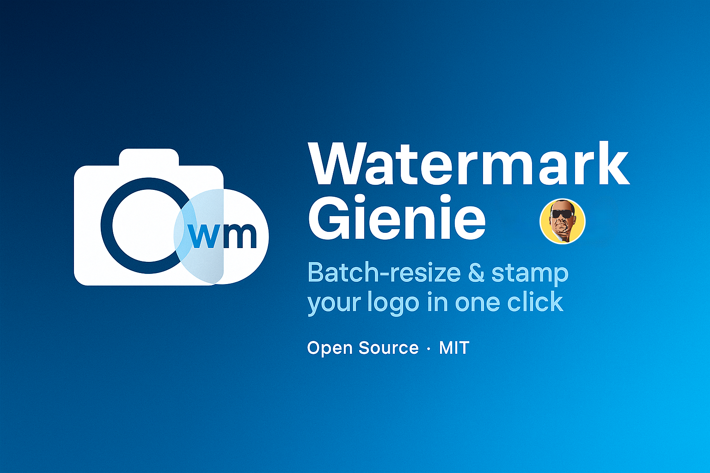
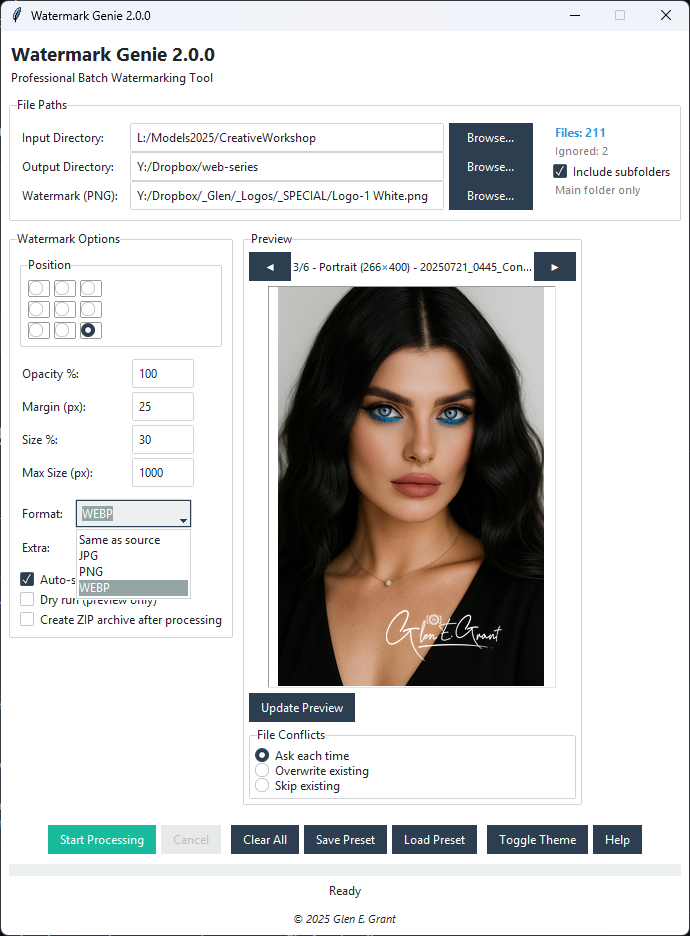
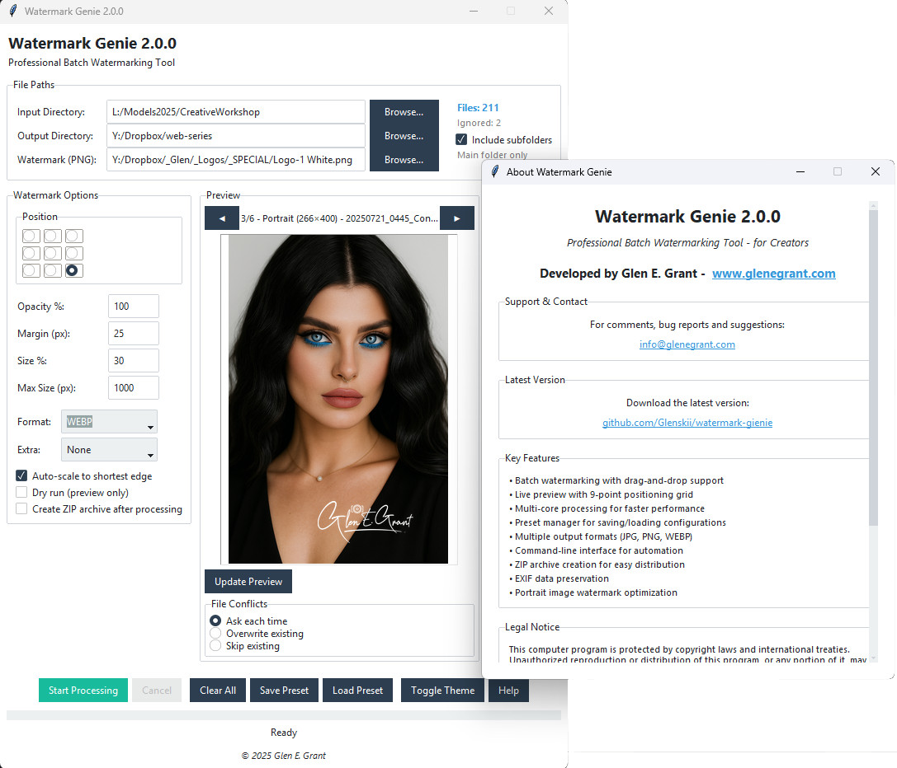

# Watermark Genie 2.0



> **Built by a Photographer for Creatives. Free forever.**

Watermark Genie is a professional batch watermarking application that lets you resize and stamp hundreds of photos with your logo in one click. Whether you're a photographer protecting your work or a content creator adding branding, this tool handles everything from single images to massive batches with reliable, proven performance.

## 🚀 What's New in V2.0 (Released July 21, 2025)

**Complete rewrite with major performance and feature improvements:**

**🎯 Live Preview System** - Real-time watermark positioning with dynamic canvas sizing  
**💾 Preset Manager** - Save/load configurations as .wgpreset files  
**🧵 Multi-Core Processing** - 2-3x faster with ThreadPoolExecutor  
**⚡ Command-Line Interface** - Full CLI automation support  
**🎨 Dark Theme Toggle** - Modern interface themes  
**📦 ZIP Archive Creation** - Automatic batch packaging  
**🖱️ Drag & Drop Support** - Intuitive file and folder handling  
**📱 Portrait Optimization** - Enhanced watermark scaling for tall images  
**🔄 Real-Time Updates** - Settings changes instantly update preview  

## ✨ Core Features

**🚀 Proven Reliability**  
Battle-tested with thousands of successful deployments. Handles massive batches without breaking a sweat.

**🎯 9-Point Precision**  
Precise watermark placement with a professional 9-point grid system. Position your logo exactly where you want it.

**🔧 One-Click Processing**  
Select your folders, choose your settings, and let the tool handle the rest. No complex configuration required.

**📱 Clean Interface**  
Professional, distraction-free interface that gets out of your way. Focus on your work, not the tool.

**📊 Complete Logging**  
Detailed CSV reports of every processed image. Perfect for client deliverables and quality control.

## 🎯 Perfect For

- **Photographers** protecting portfolio images
- **Content creators** adding brand watermarks  
- **Graphic designers** batch-processing client work
- **Agencies** streamlining deliverable workflows
- **Stock photographers** preparing uploads
- **Creatives** needing consistent, professional watermarking

## 📥 Download & Installation

### Windows (Recommended)

**Option 1: Windows Installer (New in V2.0)**
- Download `Watermark-Genie-2.0-Setup.exe` from [Releases](https://github.com/Glenskii/watermark-gienie/releases)
- Run installer for full integration (Start Menu, Desktop shortcuts, Uninstaller)
- Professional installation experience

**Option 2: Portable Executable**
- Download `Watermark-Genie-2.0.exe` from [Releases](https://github.com/Glenskii/watermark-gienie/releases)
- Run directly - no installation required
- Perfect for USB drives or testing

### From Source
```bash
# Requirements: Python 3.12+
git clone https://github.com/Glenskii/watermark-gienie.git
cd watermark-gienie
pip install pillow ttkbootstrap tkinterdnd2
python watermark_genie.py
```

## 🚀 Quick Start

### GUI Mode (Default)
1. **Launch** the application
2. **Select Input Folder** - Browse to where your images are stored
3. **Choose Output Folder** - Select where processed images will be saved
4. **Load Watermark** - Browse to your PNG logo file
5. **Live Preview** - See real-time watermark positioning
6. **Configure Settings** - Position, size, opacity, and margins
7. **Start Processing** - Multi-core batch processing begins

### Command-Line Mode (New in V2.0)
```bash
# Basic watermarking
watermark_genie.exe --cli -i "photos/" -o "output/" -w "logo.png"

# Advanced options with auto-scale and ZIP creation
watermark_genie.exe --cli \
  -i "input/" -o "output/" -w "watermark.png" \
  --anchor BR --scale 25 --opacity 80 --margin 30 \
  --fmt JPG --extra WEBP --auto --zip
```

## 💡 Feature Requests & Bug Reports

**Have an idea or found an issue?** We want to hear from you!

🔗 **[Submit Feature Request or Bug Report](https://github.com/Glenskii/watermark-gienie/issues/new)** 

*Takes 2 minutes • No GitHub experience needed • Just fill out the form*

## 🎨 V2.0 Features in Detail

### Live Preview System
- **Dynamic Canvas Sizing** - Automatically adjusts for landscape/portrait images
- **Real-Time Updates** - See changes instantly as you adjust settings
- **Multi-Image Navigation** - Preview different orientations and sizes
- **500ms Smart Debouncing** - Prevents performance issues during rapid changes

### Enhanced Processing Engine
- **Multi-Core Support** - Uses all CPU cores for 2-3x speed improvement
- **Portrait Optimization** - Smart watermark sizing for tall images (1.5x multiplier)
- **Auto-Scale Mode** - Scale to shortest edge instead of width for mixed orientations
- **Memory Efficient** - Processes large batches without memory issues

### Professional Preset System
- **Save Configurations** - Export settings as .wgpreset files
- **Load Presets** - Quick access to common workflows
- **JSON Format** - Human-readable, version-controlled presets
- **Cross-Platform** - Works on Windows, Mac, and Linux

### Advanced Output Options
- **Dual-Format Export** - Save in two formats simultaneously (JPG + PNG/WEBP)
- **ZIP Archive Creation** - Automatic batch packaging for client delivery
- **EXIF Preservation** - Maintains original metadata
- **Flexible Naming** - Maintains directory structure in output

## 🎛️ Settings Reference

| Setting | Description | V2.0 Enhancement |
|---------|-------------|------------------|
| **Position** | 9-point watermark placement | Live preview updates |
| **Scale** | Size as percentage | Portrait optimization |
| **Opacity** | Transparency level | Real-time preview |
| **Margin** | Edge spacing in pixels | Dynamic preview |
| **Auto-Scale** | Scale to shortest edge | NEW: Better for mixed orientations |
| **Max Size** | Image resize limit | Multi-core processing |
| **Formats** | Primary + Extra output | NEW: ZIP packaging |
| **Presets** | Save/load configurations | NEW: .wgpreset files |

## 📁 File Support

### Input Formats
- **JPG/JPEG** - Most common photo format
- **PNG** - Lossless with transparency
- **WEBP** - Modern web format  
- **TIFF** - Professional/print format
- **BMP** - Basic bitmap format

### Output Formats
- **JPG** - Optimal for photos (smaller files)
- **PNG** - Best for graphics/transparency needs
- **WEBP** - Modern format with excellent compression

### Watermark Requirements
- **Format**: PNG with transparency recommended
- **Orientation**: Works with any aspect ratio
- **Size**: Automatically scaled to percentage

## 📸 Screenshots

### V2.0 Interface with Live Preview



*New live preview system with dynamic canvas sizing and real-time updates*

### Built-in Help and Documentation



*Comprehensive help system with feature overview and support links*

### Command-Line Interface

```bash
$ watermark_genie.exe --cli --help
Watermark Genie - Professional batch watermarking tool

Examples:
  watermark_genie.exe --cli -i photos/ -o watermarked/ -w logo.png
  watermark_genie.exe --cli -i photos/ -o output/ -w logo.png --anchor BR --scale 25 --auto
```

## 🔧 Troubleshooting

### Common V2.0 Issues

**"Windows Defender blocks executable"**
- Click "More info" → "Run anyway"
- Add executable to Windows Defender exclusions
- This is normal for unsigned executables

**"Drag-and-drop not working"**
- Uses optional tkinterdnd2 library
- Still works via "Browse..." buttons if library unavailable
- All functionality accessible through standard file dialogs

**"Processing slower than expected"**
- V2.0 uses multi-core by default (2-3x faster than V1.4.4)
- Large images (>20MP) may take longer due to quality processing
- Check available RAM for very large batches

**"Preview not updating"**
- Ensure both input folder and watermark file are selected
- Preview updates automatically with 500ms delay
- Click "Update Preview" button to force refresh

### Getting Help
- Check [Issues](https://github.com/Glenskii/watermark-gienie/issues) for known problems
- Create new issue with error details and processing log
- Contact: info@glenegrant.com

## 🗺️ Version History

### Version 2.0.0 (July 21, 2025) - Major Release
- **🔄 Complete rewrite** - Modern Python architecture
- **🎯 Live Preview System** - Real-time watermark positioning
- **💾 Preset Manager** - Save/load configurations
- **🧵 Multi-Core Processing** - 2-3x performance improvement
- **⚡ Command-Line Interface** - Full automation support
- **🎨 Dark Theme Toggle** - Modern UI themes
- **📦 ZIP Archive Creation** - Batch packaging
- **🖱️ Drag & Drop Support** - Enhanced usability
- **📱 Portrait Optimization** - Better watermark scaling

### Version 1.4.4 (Legacy Stable)
- Proven batch watermarking engine
- 9-point positioning system
- Dual-format export
- EXIF preservation
- CSV logging

## 🚀 Performance Comparison

| Feature | V1.4.4 | V2.0 | Improvement |
|---------|--------|------|-------------|
| **Processing Speed** | ~2-3 images/sec | ~6-8 images/sec | **3x faster** |
| **Memory Usage** | Variable | ~50-100MB | **Optimized** |
| **UI Responsiveness** | Basic | Real-time | **Live updates** |
| **Portrait Handling** | Basic scaling | Optimized | **1.5x multiplier** |
| **Automation** | GUI only | GUI + CLI | **Full CLI** |

## 🤝 Contributing

Contributions are welcome! Please feel free to:

1. **Report Bugs** - Use the Issues tab with detailed descriptions
2. **Request Features** - Submit feature requests via GitHub Issues
3. **Test Beta Versions** - Help validate new features
4. **Improve Documentation** - Help others understand the tool

### How to Submit Issues or Feature Requests

**For Bug Reports or Feature Requests:**
1. Go to [GitHub Issues](https://github.com/Glenskii/watermark-gienie/issues)
2. Click **"New issue"**
3. Choose **"Bug report"** or **"Feature request"**
4. Fill out the template form (it will guide you through the details)
5. Click **"Submit new issue"**

**No GitHub experience required** - just follow the form prompts!

### Development Setup
```bash
git clone https://github.com/Glenskii/watermark-gienie.git
cd watermark-gienie
python -m venv venv
source venv/bin/activate  # Linux/Mac
# OR
venv\Scripts\activate     # Windows
pip install pillow ttkbootstrap tkinterdnd2
```

## 📜 License

This project is licensed under the MIT License - see the [LICENSE](LICENSE) file for details.

**What this means:**
- ✅ Free for personal and commercial use
- ✅ Modify and distribute freely
- ✅ No restrictions on usage
- ✅ No warranty (use at your own risk)

## 📞 Support

**Project Links:**
- 🌐 Website: [glenegrant.com](https://www.glenegrant.com)
- 📧 Email: info@glenegrant.com
- 🐛 Issues: [GitHub Issues](https://github.com/Glenskii/watermark-gienie/issues)
- 📖 Documentation: [Technical Docs](docs/)
- 📦 Releases: [GitHub Releases](https://github.com/Glenskii/watermark-gienie/releases)

## 🙏 Acknowledgments

- Built with [Pillow](https://pillow.readthedocs.io/) for reliable image processing
- Enhanced UI using [ttkbootstrap](https://ttkbootstrap.readthedocs.io/) theming
- Drag-and-drop powered by [tkinterdnd2](https://github.com/pmgagne/tkinterdnd2)
- Tested by photographers worldwide

---

**⭐ If this tool helps your workflow, please star the repository!**

*Watermark Genie - Professional batch watermarking made simple.*
