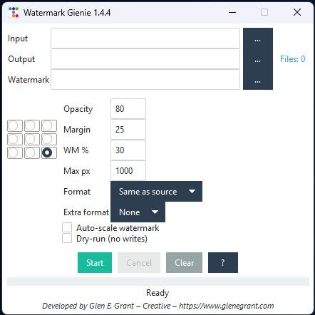

# Watermark Genie


> **Built by a Photographer for Creatives. Free forever.**

Watermark Genie is a professional batch watermarking application that lets you resize and stamp hundreds of photos with your logo in one click. Whether you're a photographer protecting your work or a content creator adding branding, this tool handles everything from single images to massive batches with reliable, proven performance.

## ✨ What Makes This Special

**🚀 Proven Reliability**  
Battle-tested v1.4.4 with thousands of successful deployments. Handles massive batches without breaking a sweat.

**🎯 9-Point Precision**  
Precise watermark placement with a professional 9-point grid system. Position your logo exactly where you want it.

**🔧 One-Click Processing**  
Select your folders, choose your settings, and let the tool handle the rest. No complex configuration required.

**📱 Clean Interface**  
Professional, distraction-free interface that gets out of your way. Focus on your work, not the tool.

**📊 Complete Logging**  
Detailed CSV reports of every processed image. Perfect for client deliverables and quality control.

## 🎯 Perfect For

- **Photographers** protecting portfolio images
- **Content creators** adding brand watermarks  
- **Graphic designers** batch-processing client work
- **Agencies** streamlining deliverable workflows
- **Stock photographers** preparing uploads
- **Creatives** needing consistent, professional watermarking

## 🚀 Quick Start

### Download & Run

**Current Stable (v1.4.4):**
1. Download from [Releases](https://github.com/Glenskii/watermark-gienie/releases)
2. Run `Watermark Genie 1.4.4.exe` (Windows) - no installation required
3. Select your input folder, output folder, and watermark PNG
4. Choose your settings and click **Start**

**Coming This Weekend (v2.0):**
Complete rewrite with live preview, presets, CLI, drag-and-drop, and 3x faster processing!

### Basic Usage
1. **Input Folder** - Browse to select where your images are stored
2. **Output Folder** - Choose where processed images will be saved  
3. **Watermark File** - Select your PNG logo file
4. **Adjust Settings** - Position, size, opacity, and margins
5. **Start Processing** - Batch watermark all images

## 🎨 Current Features (v1.4.4)

### Core Functionality
- **Batch Processing** - Handle unlimited images in one operation
- **9-Point Positioning** - Precise watermark placement (corners, edges, center)
- **Smart Scaling** - Percentage-based size adjustment 
- **Format Support** - JPG, PNG, WEBP, TIFF, BMP input
- **EXIF Preservation** - Maintain original image metadata
- **Dual-Format Export** - Save in two formats simultaneously

### Professional Features
- **📊 CSV Logging** - Detailed processing reports
- **🔧 Batch Configuration** - Consistent settings across large batches
- **💾 Reliable Processing** - Proven stability with thousands of images
- **🎯 Precise Control** - Pixel-perfect margins and opacity settings
- **📁 Recursive Scanning** - Automatically finds images in subfolders

### Watermark Controls
- **Position**: 9-point grid (TL/TC/TR/CL/CC/CR/BL/BC/BR)
- **Size**: Percentage-based scaling (1-100% of image width)
- **Opacity**: Transparency control (0-100%)
- **Margin**: Pixel-perfect edge spacing
- **Max Size**: Image resize limits for consistent output

## 📸 Screenshots

### Current Interface (v1.4.4)



*Clean, professional interface with 9-point positioning grid and precise control settings*

## 🛠️ Installation

### Windows (Recommended)
Download the pre-built executable from [Releases](https://github.com/Glenskii/watermark-gienie/releases) - no installation required.

### From Source
```bash
# Requirements: Python 3.12+
git clone https://github.com/Glenskii/watermark-gienie.git
cd watermark-gienie
pip install pillow
python watermark_genie_v144.py
```

## 🔧 Usage Guide

### Step-by-Step Workflow
1. **Launch** the application
2. **Select Input Folder** - Browse to where your images are stored
3. **Choose Output Folder** - Select where processed images will be saved (must be different from input)
4. **Load Watermark** - Browse to your PNG logo file
5. **Configure Position** - Use 9-point grid to position watermark
6. **Set Size & Opacity** - Adjust watermark scale and transparency
7. **Choose Output Format** - Select JPG, PNG, or WEBP
8. **Start Processing** - Click Start to begin batch processing

### Pro Tips
- **Use PNG watermarks** with transparency for best results
- **Test with small batches** first to verify settings
- **Check CSV logs** for detailed processing reports
- **Keep input and output folders separate** to avoid conflicts

## 🎛️ Settings Reference

| Setting | Description | Options |
|---------|-------------|---------|
| **Position** | Watermark placement | TL, TC, TR, CL, CC, CR, BL, BC, BR |
| **Scale** | Size as percentage | 1-100% of image width |
| **Opacity** | Transparency level | 0-100% (0=invisible, 100=opaque) |
| **Margin** | Edge spacing | Pixels from image edge |
| **Max Size** | Image resize limit | Maximum width/height in pixels |
| **Primary Format** | Main output format | Same as source, JPG, PNG, WEBP |
| **Extra Format** | Second output | None, JPG, PNG, WEBP |

## 📁 File Support

### Input Formats
- **JPG/JPEG** - Most common photo format
- **PNG** - Lossless with transparency
- **WEBP** - Modern web format  
- **TIFF** - Professional/print format
- **BMP** - Basic bitmap format

### Output Formats
- **JPG** - Optimal for photos (smaller files)
- **PNG** - Best for graphics/transparency needs
- **WEBP** - Modern format with excellent compression

### Watermark Requirements
- **Format**: PNG with transparency recommended
- **Orientation**: Square or landscape works best
- **Size**: Any resolution (automatically scaled to percentage)

## 🔧 Troubleshooting

### Common Issues

**"No images found in input folder"**
- Ensure folder contains supported image formats
- Check that subfolders contain images if using recursive scan

**"Output folder cannot be inside input folder"**
- Choose a completely separate output directory
- This prevents processing conflicts and infinite loops

**"Windows Defender blocks executable"**
- Click "More info" → "Run anyway"
- Add executable to Windows Defender exclusions

**"Processing stopped unexpectedly"**
- Check available disk space in output folder
- Verify all input images are accessible and not corrupted
- Review CSV log for specific error details

### Getting Help
- Check [Issues](https://github.com/Glenskii/watermark-gienie/issues) for known problems
- Create new issue with error details and CSV log
- Contact: info@glenegrant.com

## 🗺️ Release Timeline

### Version 2.0 (2025-07-21)
- **🔄 Live Preview System** - Real-time watermark positioning with dynamic canvas
- **💾 Preset Manager** - Save/load configurations as .wgpreset files
- **🎨 Dark Theme Toggle** - Modern interface themes
- **📦 ZIP Archive Creation** - Automatic batch packaging
- **🧵 Multi-Core Processing** - 2-3x faster with ThreadPoolExecutor
- **⚡ Command-Line Interface** - Full CLI automation support
- **🖱️ Drag & Drop Support** - Intuitive file and folder handling (not ready)
- **📊 Enhanced Logging** - Improved CSV reports and error handling

### Version 2.5+ (Future)
- **macOS Support** - Native .app bundle
- **Dual Logo Placement** - For event, wedding photographers 2 logos 1 process 
- **Watch Folder** - Automatic processing
- **Advanced Effects** - More watermark options
- **Cloud Integration** - Optional cloud processing

## 🤝 Contributing

Contributions are welcome! Please feel free to:

1. **Report Bugs** - Use the Issues tab with detailed descriptions
2. **Suggest Features** - Share ideas for v2.0 and beyond
3. **Test Beta Versions** - Help validate new features
4. **Improve Documentation** - Help others understand the tool

### Development Setup
```bash
git clone https://github.com/Glenskii/watermark-gienie.git
cd watermark-gienie
python -m venv venv
source venv/bin/activate  # Linux/Mac
# OR
venv\Scripts\activate     # Windows
pip install pillow
```

## 📜 License

This project is licensed under the MIT License - see the [LICENSE](LICENSE) file for details.

**What this means:**
- ✅ Free for personal and commercial use
- ✅ Modify and distribute freely
- ✅ No restrictions on usage
- ✅ No warranty (use at your own risk)

## 📞 Support

**Project Links:**
- 🌐 Website: [glenegrant.com](https://www.glenegrant.com)
- 📧 Email: info@glenegrant.com
- 🐛 Issues: [GitHub Issues](https://github.com/Glenskii/watermark-gienie/issues)
- 📖 Full Documentation: [Technical Docs](PROJECT_HANDBOOK.md)

## 🙏 Acknowledgments

- Built with [Pillow](https://pillow.readthedocs.io/) for reliable image processing
- Professional UI using Python's tkinter framework
- Tested by photographers worldwide

---

**⭐ If this tool helps your workflow, please star the repository!**

*Watermark Genie - Professional batch watermarking made simple.*